# Search OmniFocus Alfred Workflow

## What is this?

This is a workflow for [Alfred 2](http://www.alfredapp.com/) that performs free text searches on [OmniFocus](http://www.omnigroup.com/omnifocus) data.

## Why would I want such a thing?

Well, I want it because I can't quickly search for, say, a task within OmniFocus using OmniFocus' search field. OmniFocus restricts search results to the current perspective or selection. [Other people have noticed this too](https://discourse.omnigroup.com/t/how-to-search-all-content-a-via-changed-perspective/366).

## How to install

[Download the `.workflow` file from the Releases page](https://github.com/rhydlewis/search-omnifocus/releases/).

## How to use

### Searching for tasks

* Search for all tasks within OmniFocus (irrespective of status) with **.s**:

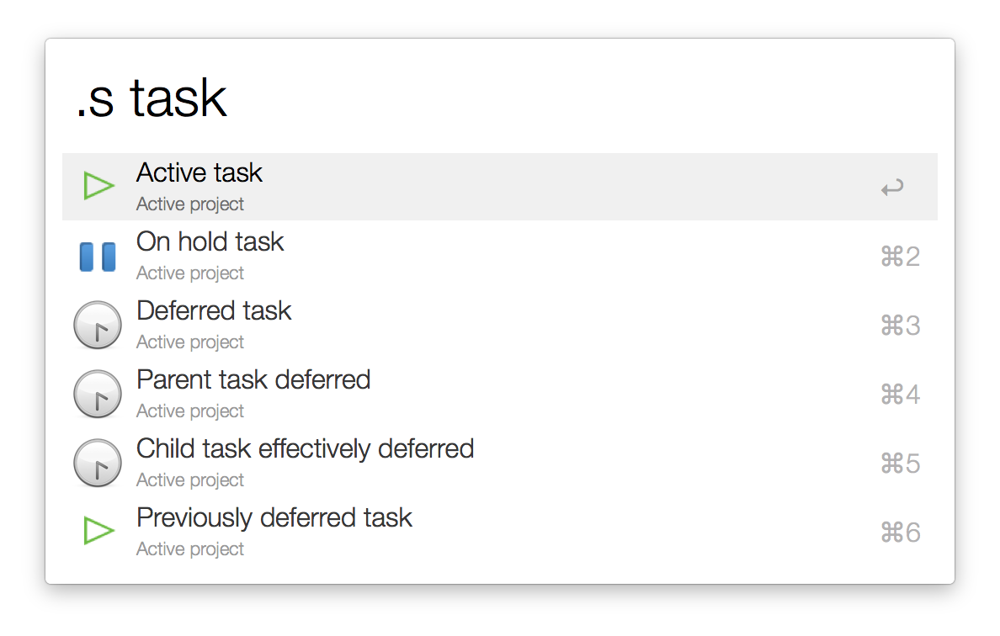

### Searching the inbox

* Search the OmniFocus inbox with **.i**:

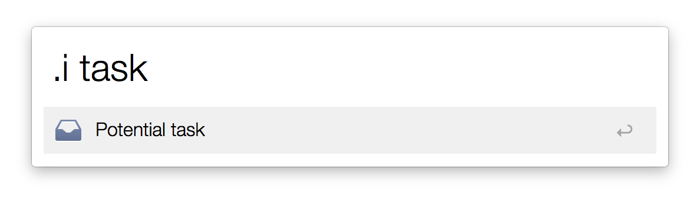

### Searching for projects

* Search for projects with **.p**:

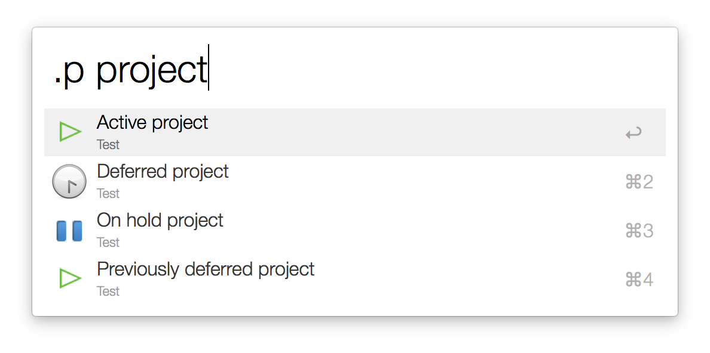

### Searching for contexts

* Search for a specific context with **.c**:

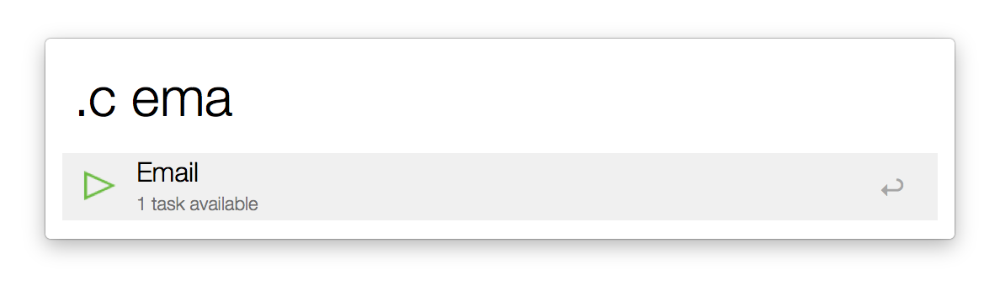

or just list all contexts with **.lc**:

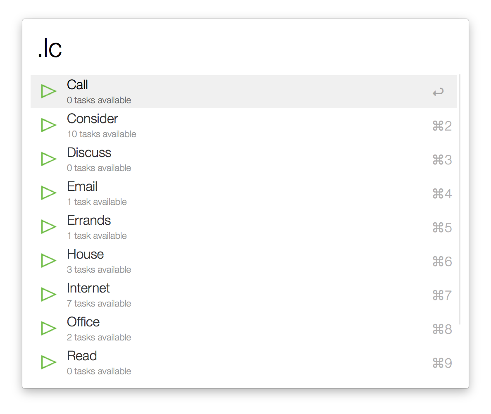

### Searching for perspectives

* Search for a specific perspective with **.v**:

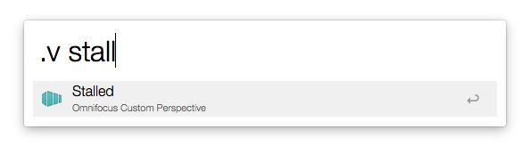

or just list all perspectives with **.lv**:

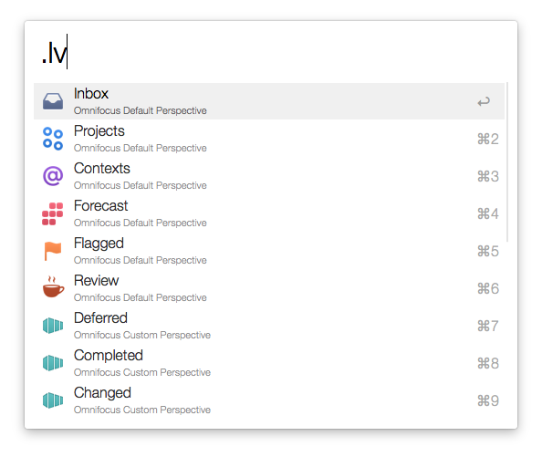

### Searching for folders

* Search for a specific folder with **.f**:

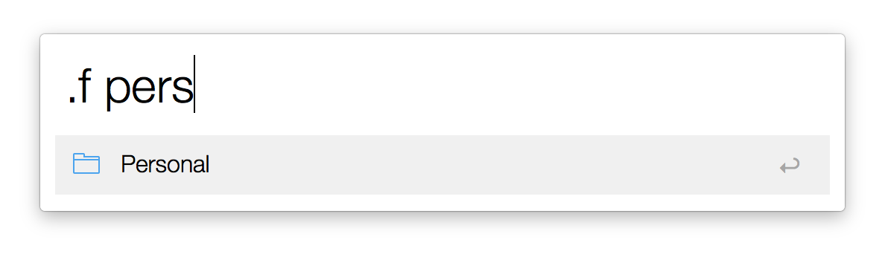

or just list all folders with **.lf**:

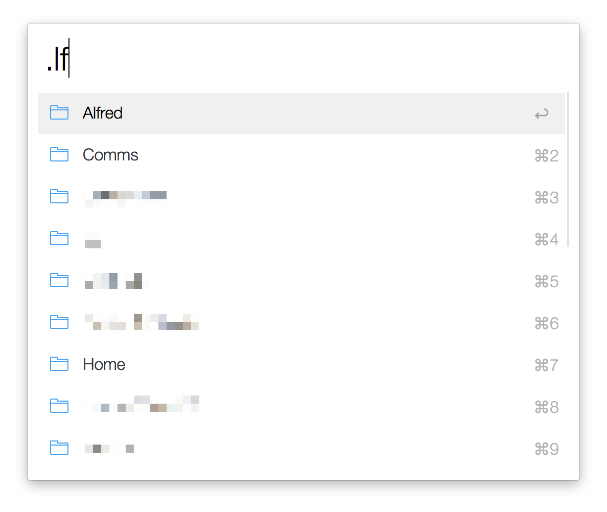

### Narrowing results

* Search just for *active* tasks with **.sa**:

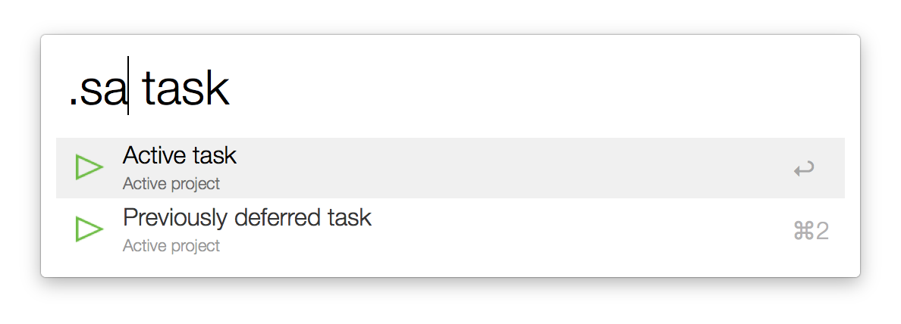

or just for *active* projects with **.pa**:

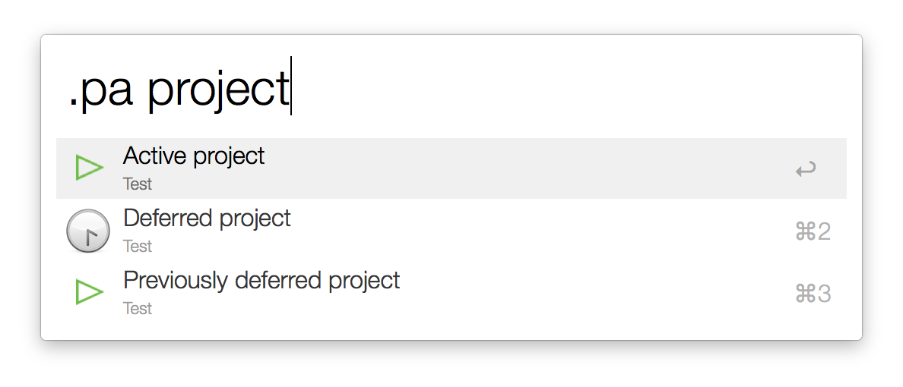

* Search all *flagged* tasks with **.g**:
 

or for *flagged* and *active* tasks with **.ga**:

## Thanks to...

* [Dean Jackson](https://github.com/deanishe): the [Python library for Alfred workflows](https://github.com/deanishe/alfred-workflow) does most of the heavy lifting. Excellent stuff, thank you.
* [Marko Kaestner](https://github.com/markokaestner): I used the [in-depth workflow](https://github.com/markokaestner/of-task-actions) to provide some insight into how to search Omnifocus.
* [Danny Smith](https://github.com/dannysmith): for providing a new, and quite frankly, much improved workflow icon.

