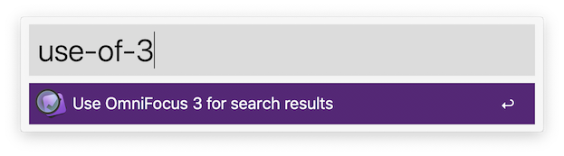
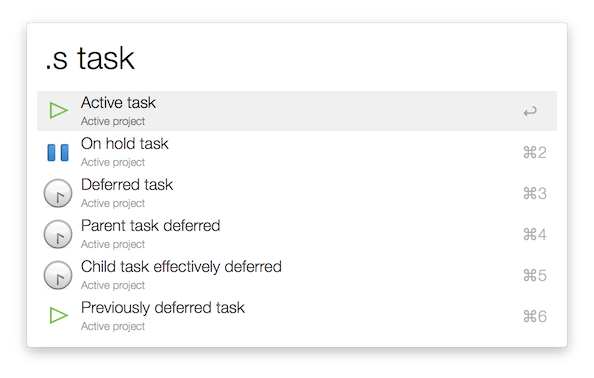
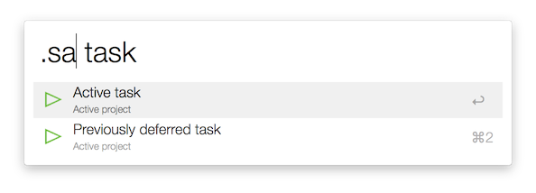
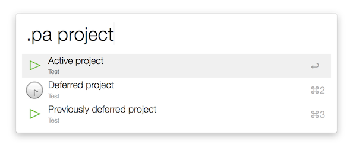
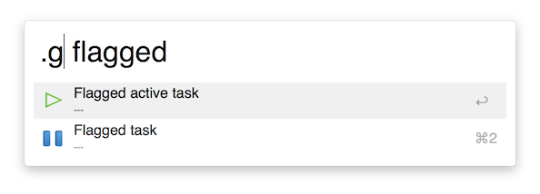
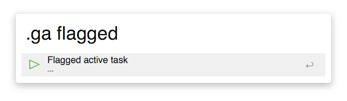
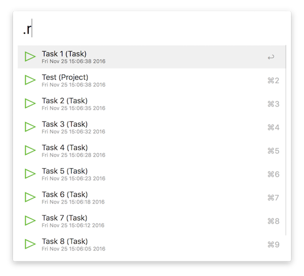
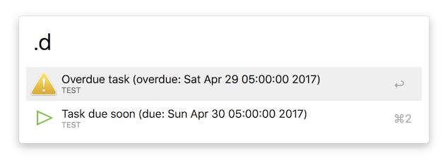

# Search OmniFocus Alfred Workflow

## What is this?

This is a workflow for [Alfred](http://www.alfredapp.com/) that performs free text searches on [OmniFocus](http://www.omnigroup.com/omnifocus) data.

## Why would I want such a thing?

Well, I want it because I can't quickly search for, say, a task within OmniFocus using OmniFocus' search field. OmniFocus restricts search results to the current perspective or selection. [Other people have noticed this too](https://discourse.omnigroup.com/t/how-to-search-all-content-a-via-changed-perspective/366).

## How to install

[Download the `.workflow` file from the Releases page](https://github.com/rhydlewis/search-omnifocus/releases/).

## How to use

## Setting up

The workflow assumes you're using OmniFocus 2 by default. To use OmniFocus 3 instead, run `use-of-3`:

To switch back to OmniFocus 2, run `use-of-2`:

### Searching for tasks

* Search for all tasks within OmniFocus (irrespective of status) with `.s`:

### Searching for tasks in the Inbox and the Library 

* Search for all tasks within OmniFocus (whether you've processed them or not) with `.se`.

### Searching the inbox

* Search the OmniFocus inbox with `.i`:

or just list all tasks in the inbox with `.li`.

### Searching for projects

* Search for projects with `.p`:

### Searching for tags or contexts

* Search for a specific tag with `.t` or context with `.c`:

or just list all tags with `.lt` or contexts with `.lc`:

* Search for a specific context with `.c`:

### Searching for perspectives

* Search for a specific perspective with `.v`:

or just list all perspectives with `.lv`:

### Searching for folders

* Search for a specific folder with `.f`:

or just list all folders with `.lf`:

### Searching for task or projects notes
 
* Search for a specific note in a task or project with `.n`:

* Search for a specific note in a flagged task `.ng`
* Search for a specific note in active task `.na`

### Narrowing results

* Search just for *active* tasks with `.sa`:

or just for *active* projects with `.pa`:

* Search all *flagged* tasks with `.g`:
 

or for *flagged* and *active* tasks with `.ga`:

* Show the 10 most recently modified tasks with `.r`:

or show the 10 most recently modfified and non-completed tasks or projects with `.ra`:

* Show overdue or due items with `.d`:

## Thanks to...

* [Dean Jackson](https://github.com/deanishe): the [Python library for Alfred workflows](https://github.com/deanishe/alfred-workflow) does most of the heavy lifting. Excellent stuff, thank you.
* [Marko Kaestner](https://github.com/markokaestner): I used the [in-depth workflow](https://github.com/markokaestner/of-task-actions) to provide some insight into how to search Omnifocus.
* [Danny Smith](https://github.com/dannysmith): for providing a new, and quite frankly, much improved workflow icon.

